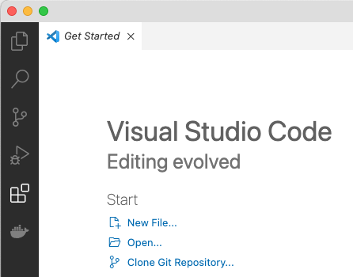
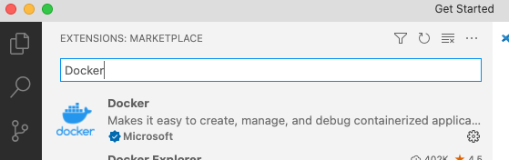

# VScode Setup
This tutorial will introduce you to vscode.
## Installation
You should go through this [page](https://code.visualstudio.com/docs/setup/setup-overview) to install vscode on your laptop or desktop.
## Configuration
Since we will be using Docker as a web server, add the Docker extension to vscode.
1. Run vscode
2. Select Extensions on the left sidebar  

2. Search for Docker and select the extension  
 
3. Install the extension.
4. Worth through this [tutorial video](https://code.visualstudio.com/docs/introvideos/basics) to figure out how to use the basic features of vscode.
